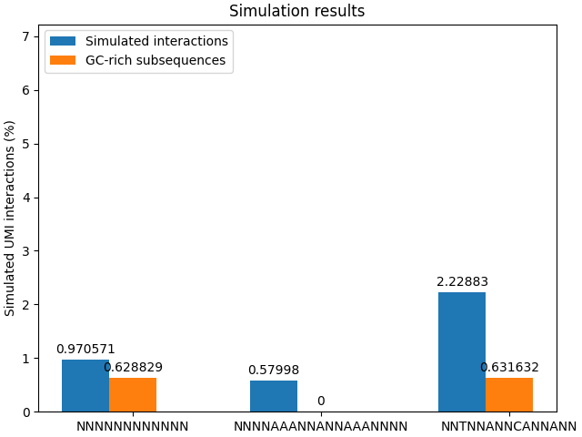

# structuredUMI
Python scripts for simulating structured barcode interactions

## Reference
Peter Micallef, Manuel Luna Santamaría, Daniel Andersson, Tobias Österlund, Stefan Filges, Gustav Johansson, Anders Ståhlberg. Digital sequencing using structured unique molecular identifiers. Manuscript

## Installation

```
pip install https://github.com/stahlberggroup/structuredUMI/archive/refs/tags/structuredUMI.tar.gz
```

## Usage

`simulation_structured_umi.py`

Optional arguments:

|Options   |Options long        |Description                                                                                                                                      |
|:---------|:-------------------|:------------------------------------------------------------------------------------------------------------------------------------------------|
|`-u`      |`--umi-structure`   |Structure of the UMI, e.g. `NNNTTNNNCCNNNGGNNN`. Default = `NNNNNNNNNNNN`                                                                        |
|`-l`      |`--label`           |Label of the simulation for output. Default is UMI structure.                                                                                    |
|`-n`      |`--n-samples`       |Number of sampled (simulated) UMIs. Default = 1000.                                                                                              |
|`-w`      |`--window_size`     |The window size used for overlap, i.e. minimum required overlap. Default = 6.                                                                    |
|`-gc`     |`--gc-cutoff`       |Number of GC bases within the window to be reported as  a gc-rich sub-sequence. Default = 3.                                                     |
|`-o`      |`--output-file`     |Output file. Note that the output file can be appended with new simulations if an existing file is specified. Default is to write to stdout (-). |

`simulation_umi_design_1-7777777.py -h`

`plot_simulation_results.py`

## Usage examples

```
simulation_structured_umi.py -u NNNNNNNNNNNN -o output.txt
simulation_structured_umi.py -u NNNNAAANNANNAAANNNN -o output.txt #simulation results are appended to output.txt
simulation_structured_umi.py -u NNTNNANNCANNANN -o output.txt
plot_simulation_results.py -i output.txt --save -p plot_results.png
```

This generates the following plot:




## Output formats

The output from the simulation is one row with the following columns. 

|Label        | Number of comparisons| Number of interactions| Number of GC rich interactions| Fraction of interactions| Fraction of GC |
|:------------|---------------------:|----------------------:|------------------------------:|------------------------:|---------------:|
|NNNNNNNNNNNN |                499500|                   4848|                           3141|                0.0097057|       0.0062883|

## Requirements

Python 3 is needed, and the python packages Matplotlib and numpy.

